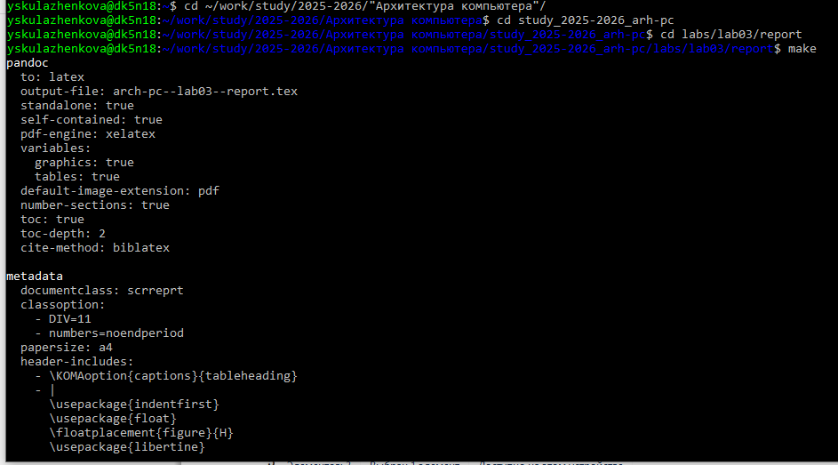
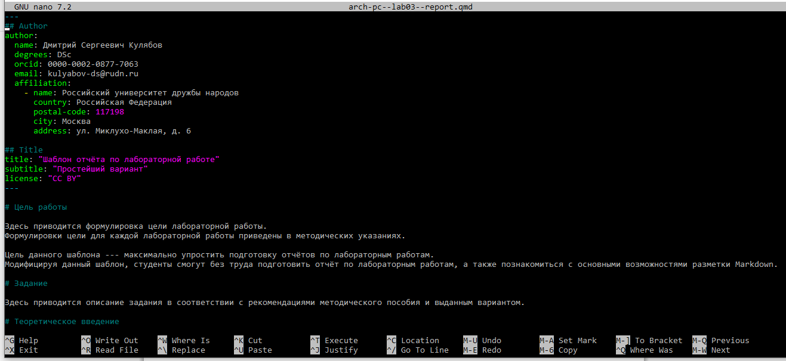

---
## Author
author:
  name: Кулаженкова Яна Сергеевна
  email: 1032253497@pfur.ru
  affiliation:
    - name: Российский университет дружбы народов
      country: Российская Федерация
      postal-code: 117198
      city: Москва
      address: ул. Миклухо-Маклая, д. 6

## Title
title: "Отчёт по лабораторной работе №3"
license: "CC BY"
---

# Цель работы

Целью данной лабораторной работы является освоение процедуры оформления отчетов с помощью легковесного языка разметки Markdown.

# Задание

1. Установка необходимого ПО
2. Заполнение отчета по выполнению лабораторной работы №3 с помощью языка разметки Markdown
3. Задание для самостоятельной работы

# Теоретическое введение

Markdown — облегчённый язык разметки, созданный с целью обозначения форматирования в простом тексте, с максимальным сохранением его читаемости человеком, и пригодный для машинного преобразования в языки для продвинутых публикаций (HTML, Rich Text и других).

# Выполнение лабораторной работы

## Компиляция шаблонов отчета

В терминале перехожу в директорию курса, обновляю репозиторий с удаленного на GitHub (рис. @fig:001).

{#fig:001 width=70%}

Провожу компиляцию шаблона с помощью команды make (рис. @fig:002).

{#fig:002 width=70%}

Проверяю корректность выполнения команды (рис. @fig:003).

{#fig:003 width=70%}

После проверки работоспособности компилятора шаблонов, я удаляю сгенерированные файлы с помощью команды make clean.

С помощью редактора выполняю отчет по выполненной лабораторной работе (рис. @fig:004).

{#fig:004 width=70%}

{#fig:005 width=70%}

# Задания для самостоятельной работы

Аналогично выполнению отчета по текущей лабораторной работе, я выполняю отчет в markdown и по второй лабораторной работе, для этого перехожу в директорию 2 лабораторной работы и готовлю отчет с помощью текстового редактора.
[Ссылка на GitHub](https://github.com/Yana-nka/study_2025-2026_arh-pc) https://github.com/Yana-nka/study_2025-2026_arh-pc

# Выводы

В результате выполнения данной лабораторной работы я освоила процедуры оформления отчетов с помощью легковесного языка разметки Markdown.
